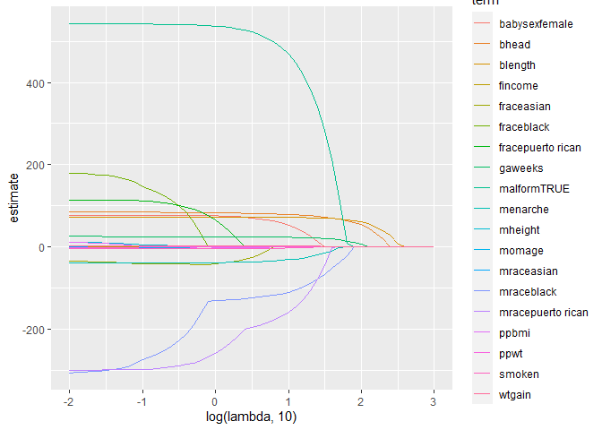
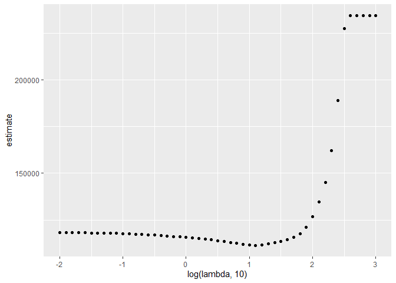
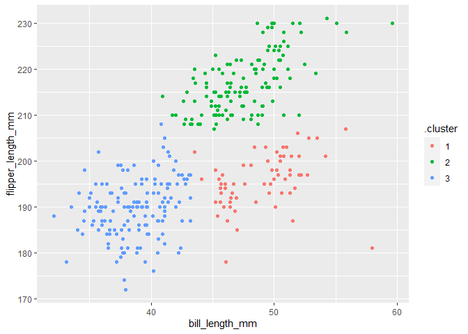

statistical_learning
================

``` r
library(tidyverse)
```

    ## Warning: package 'tidyverse' was built under R version 4.3.2

    ## ── Attaching core tidyverse packages ──────────────────────── tidyverse 2.0.0 ──
    ## ✔ dplyr     1.1.3     ✔ readr     2.1.4
    ## ✔ forcats   1.0.0     ✔ stringr   1.5.0
    ## ✔ ggplot2   3.4.3     ✔ tibble    3.2.1
    ## ✔ lubridate 1.9.2     ✔ tidyr     1.3.0
    ## ✔ purrr     1.0.2     
    ## ── Conflicts ────────────────────────────────────────── tidyverse_conflicts() ──
    ## ✖ dplyr::filter() masks stats::filter()
    ## ✖ dplyr::lag()    masks stats::lag()
    ## ℹ Use the conflicted package (<http://conflicted.r-lib.org/>) to force all conflicts to become errors

``` r
library(glmnet)
```

    ## Loading required package: Matrix

    ## Warning: package 'Matrix' was built under R version 4.3.2

    ## 
    ## Attaching package: 'Matrix'
    ## 
    ## The following objects are masked from 'package:tidyr':
    ## 
    ##     expand, pack, unpack
    ## 
    ## Loaded glmnet 4.1-8

``` r
set.seed(11)
```

## Lasso

``` r
bwt_df = 
  read_csv("data/birthweight.csv") |> 
  janitor::clean_names() |>
  mutate(
    babysex = as.factor(babysex),
    babysex = fct_recode(babysex, "male" = "1", "female" = "2"),
    frace = as.factor(frace),
    frace = fct_recode(
      frace, "white" = "1", "black" = "2", "asian" = "3", 
      "puerto rican" = "4", "other" = "8"),
    malform = as.logical(malform),
    mrace = as.factor(mrace),
    mrace = fct_recode(
      mrace, "white" = "1", "black" = "2", "asian" = "3", 
      "puerto rican" = "4")) |> 
  sample_n(200)
```

    ## Rows: 4342 Columns: 20
    ## ── Column specification ────────────────────────────────────────────────────────
    ## Delimiter: ","
    ## dbl (20): babysex, bhead, blength, bwt, delwt, fincome, frace, gaweeks, malf...
    ## 
    ## ℹ Use `spec()` to retrieve the full column specification for this data.
    ## ℹ Specify the column types or set `show_col_types = FALSE` to quiet this message.

get predictors and outcomes.

``` r
x = model.matrix(bwt ~ ., bwt_df)[, -1]

y = bwt_df |>  pull(bwt)
```

``` r
lambda = 10^(seq(3, -2, -0.1))

lasso_fit =
  glmnet(x, y, lambda = lambda)

lasso_cv =
  cv.glmnet(x, y, lambda = lambda)

lambda_opt = lasso_cv$lambda.min
```

let’s look at lasso results

``` r
lasso_fit |> 
  broom::tidy() |> 
  filter(step == 20)
```

    ## # A tibble: 12 × 5
    ##    term               step  estimate lambda dev.ratio
    ##    <chr>             <dbl>     <dbl>  <dbl>     <dbl>
    ##  1 (Intercept)          20 -3659.      12.6     0.627
    ##  2 babysexfemale        20    46.2     12.6     0.627
    ##  3 bhead                20    77.9     12.6     0.627
    ##  4 blength              20    71.8     12.6     0.627
    ##  5 fincome              20     0.253   12.6     0.627
    ##  6 gaweeks              20    23.1     12.6     0.627
    ##  7 malformTRUE          20   447.      12.6     0.627
    ##  8 menarche             20   -29.4     12.6     0.627
    ##  9 mraceblack           20  -105.      12.6     0.627
    ## 10 mracepuerto rican    20  -145.      12.6     0.627
    ## 11 smoken               20    -2.62    12.6     0.627
    ## 12 wtgain               20     2.32    12.6     0.627

``` r
lasso_fit |> 
  broom::tidy() |>
  select(term, lambda, estimate) |> 
  complete(term, lambda, fill = list(estimate = 0)) |> 
  filter(term != "(Intercept)") |> 
  ggplot(aes(x = log(lambda, 10), y = estimate, color = term, group = term)) +
  geom_path()
```

<!-- -->

show the cv results

``` r
lasso_cv |> 
  broom::tidy() |> 
  ggplot(aes(x = log(lambda, 10), y = estimate)) +
  geom_point()
```

<!-- -->

## Penguins

``` r
library(palmerpenguins)
```

    ## Warning: package 'palmerpenguins' was built under R version 4.3.2

``` r
data("penguins")

penguins |> 
  ggplot(aes(x = bill_length_mm, y = flipper_length_mm, color = species)) +
  geom_point()
```

    ## Warning: Removed 2 rows containing missing values (`geom_point()`).

<!-- -->

``` r
penguins =
  penguins |> 
  select(species, bill_length_mm, flipper_length_mm) |> 
  drop_na()

kmeans_fit =
  penguins |> 
  select(-species) |>
  scale() |> 
  kmeans(centers = 3)

penguins |> 
  broom::augment(kmeans_fit, data = _) |>  
  ggplot(aes(x = bill_length_mm, y = flipper_length_mm, color = .cluster)) +
  geom_point()
```

<!-- -->
